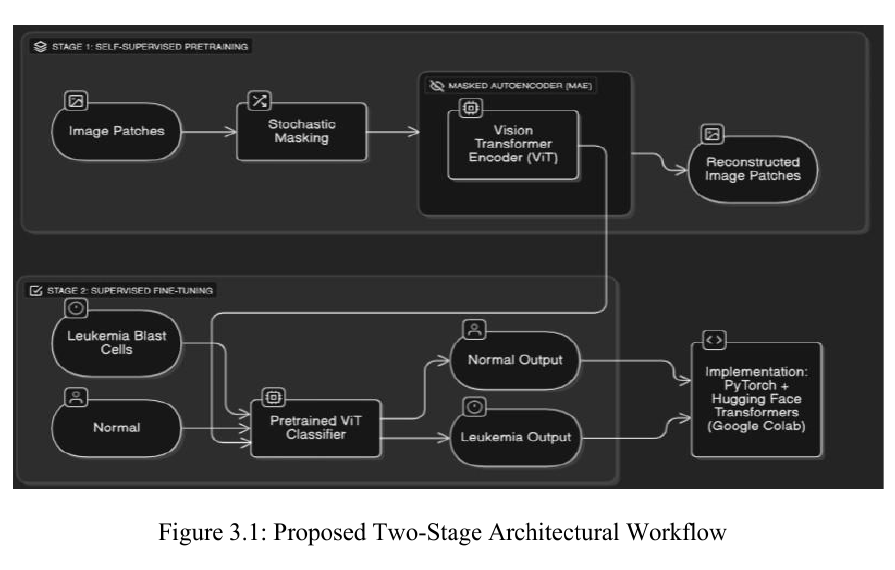
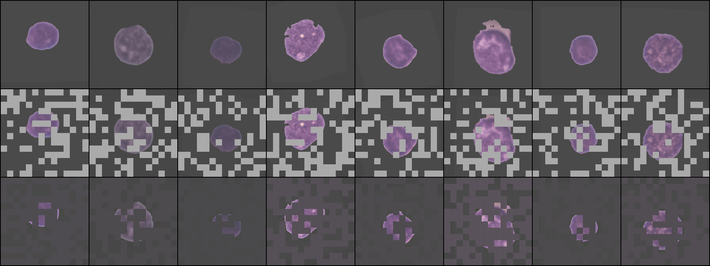
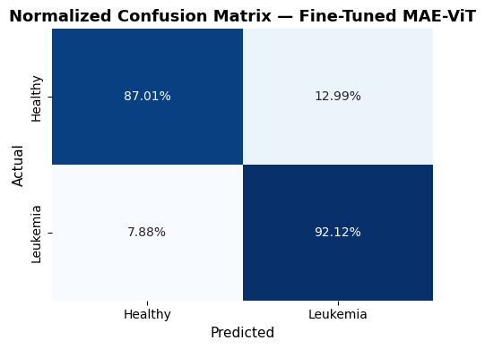
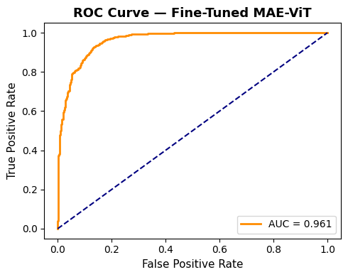
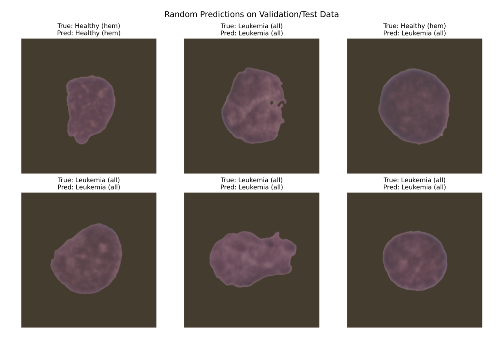
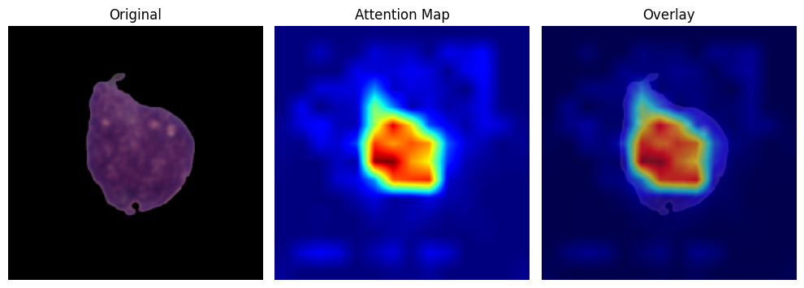

# Frequency-Aware Masked Autoencoder for Leukemia Classification

An academic deep-learning project exploring self-supervised pretraining for binary leukemia classification from microscopic blood-smear images. The workflow combines a frequency-aware masked autoencoder (FA-MAE) with a Vision Transformer classifier.

[](https://colab.research.google.com/github/SD-Abilesh/leukemia-fa-mae-vit/blob/main/notebooks/leukemia_fa_mae_vit.ipynb)

## Project highlights

- CLAHE-based image enhancement and ImageNet-compatible preprocessing
- Custom patch embedding and masked autoencoder
- Spatial reconstruction loss combined with a frequency-domain loss
- Transfer of the pretrained representation into a ViT classifier
- Frozen-backbone warmup followed by end-to-end fine-tuning
- Exponential moving average model for validation
- Accuracy, precision, recall, F1, confusion matrix, and ROC-AUC evaluation

## Architecture

The project uses two stages. First, a masked autoencoder learns representations from image patches through stochastic masking and reconstruction. Its pretrained ViT encoder is then transferred to a supervised binary classifier.



## Reported project results

| Metric | Reported value |
|---|---:|
| Accuracy | 0.9049 |
| Precision | 0.9384 |
| Recall | 0.9212 |
| F1-score | 0.9297 |
| ROC-AUC | 0.9613 |

These values are preserved from the original academic workflow and accompanying report. They have not been independently reproduced from a clean environment in this repository.

## Selected outputs

### Masked-autoencoder reconstruction

The following stored output shows original images, masked inputs, and reconstructed images at epoch 100 of the original run.



### Classification evaluation

<p align="center">
  
  
</p>

### Example predictions



### Attention visualization



## Repository contents

```text
notebooks/
└── leukemia_fa_mae_vit.ipynb
report/
└── leukemia_fa_mae_vit_report.pdf
```

The notebook contains dataset preparation, FA-MAE pretraining, ViT fine-tuning, evaluation, and example inference. The report provides the background, methodology, experimental discussion, and original figures.

## Running the notebook

The original workflow was developed in Google Colab and uses Colab, Google Drive, Kaggle, and cached-dataset paths. Before running it:

1. Open the notebook in Colab or Jupyter.
2. Install the packages listed in `requirements.txt`.
3. Replace the dataset and output paths with locations available in your environment.
4. Run the data-validation cells before starting training.

Training requires substantial GPU memory and time. The repository does not include the dataset or trained checkpoints.

## Dataset

The project uses the C-NMC leukemia classification data referenced in the report. The dataset is not redistributed here; users must obtain it from its original provider and comply with its licence and terms.

## Portfolio note

This repository preserves an academic project and its original notebook workflow. It is intended to demonstrate experience with self-supervised learning, Vision Transformers, medical-image preprocessing, and classification evaluation. It is not a diagnostic medical system.
